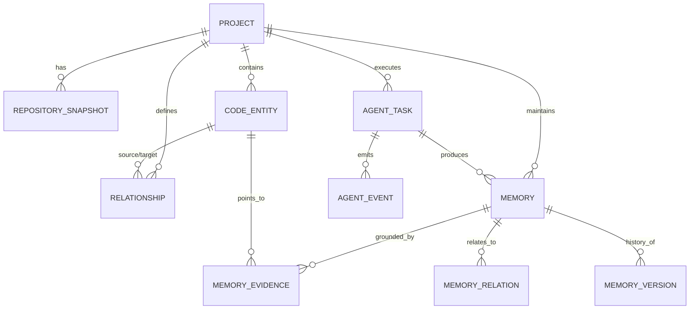

# CortexForge Data Model & Database ER Specification

## Overview
CortexForge uses PostgreSQL as the system of record. It models both the code structure and agent memory in a unified relational schema, supporting graph traversals via recursive CTEs and vector search via `pgvector`.

## Entity-Relationship Diagram (Mermaid)

## Schema Definitions

### 1. `projects`
System of record for registered repositories.
- `id`: UUID (Primary Key)
- `name`: VARCHAR(255) NOT NULL
- `repository_url`: TEXT NULL
- `local_path`: TEXT NOT NULL UNIQUE
- `default_branch`: VARCHAR(100) NOT NULL DEFAULT 'main'
- `language`: VARCHAR(50) NULL
- `last_indexed_commit`: VARCHAR(64) NULL
- `status`: VARCHAR(50) NOT NULL DEFAULT 'READY'
- `created_at`: TIMESTAMPTZ NOT NULL DEFAULT NOW()
- `updated_at`: TIMESTAMPTZ NOT NULL DEFAULT NOW()

### 2. `repository_snapshots`
Commit-level checkpoint of the repository.
- `id`: UUID (Primary Key)
- `project_id`: UUID REFERENCES projects(id) ON DELETE CASCADE
- `commit_sha`: VARCHAR(64) NOT NULL
- `file_count`: INT NOT NULL DEFAULT 0
- `symbol_count`: INT NOT NULL DEFAULT 0
- `dependency_count`: INT NOT NULL DEFAULT 0
- `created_at`: TIMESTAMPTZ NOT NULL DEFAULT NOW()

### 3. `code_entities`
AST-level deterministic symbols extracted via Tree-sitter.
- `id`: UUID (Primary Key)
- `project_id`: UUID REFERENCES projects(id) ON DELETE CASCADE
- `entity_type`: VARCHAR(50) NOT NULL (file, module, class, interface, function, method, variable, api, model, test)
- `name`: VARCHAR(255) NOT NULL
- `qualified_name`: TEXT NOT NULL
- `file_path`: TEXT NOT NULL
- `start_line`: INT NOT NULL
- `end_line`: INT NOT NULL
- `signature`: TEXT NULL
- `content_hash`: VARCHAR(64) NOT NULL
- `language`: VARCHAR(50) NOT NULL
- `metadata`: JSONB NOT NULL DEFAULT '{}'::jsonb
- `created_at`: TIMESTAMPTZ NOT NULL DEFAULT NOW()
- `updated_at`: TIMESTAMPTZ NOT NULL DEFAULT NOW()

Indexes:
- `(project_id, qualified_name)`
- `(project_id, file_path)`
- `(project_id, entity_type)`
- `(project_id, content_hash)`

### 4. `relationships`
Code graph directed edges connecting code entities.
- `id`: UUID (Primary Key)
- `project_id`: UUID REFERENCES projects(id) ON DELETE CASCADE
- `source_entity_id`: UUID REFERENCES code_entities(id) ON DELETE CASCADE
- `target_entity_id`: UUID REFERENCES code_entities(id) ON DELETE CASCADE
- `relationship_type`: VARCHAR(50) NOT NULL (imports, calls, inherits, implements, depends_on, tests, routes_to, uses, contains)
- `confidence`: FLOAT NOT NULL DEFAULT 1.0
- `source`: VARCHAR(50) NOT NULL DEFAULT 'tree_sitter'
- `created_at`: TIMESTAMPTZ NOT NULL DEFAULT NOW()

Indexes:
- `(project_id, source_entity_id, relationship_type)`
- `(project_id, target_entity_id, relationship_type)`

### 5. `memories`
Core Project Cognitive Model memory items.
- `id`: UUID (Primary Key)
- `project_id`: UUID REFERENCES projects(id) ON DELETE CASCADE
- `memory_type`: VARCHAR(50) NOT NULL (FACT, DECISION, CONSTRAINT, EPISODE, FAILURE, FIX, ARCHITECTURE, CONVENTION, GOAL, LESSON, WARNING, TASK_STATE, SKILL)
- `title`: VARCHAR(255) NOT NULL
- `content`: TEXT NOT NULL
- `summary`: TEXT NOT NULL
- `status`: VARCHAR(50) NOT NULL DEFAULT 'ACTIVE' (ACTIVE, STALE, CONFLICTED, DEPRECATED, UNVERIFIED, ARCHIVED)
- `confidence`: FLOAT NOT NULL DEFAULT 1.0
- `importance`: FLOAT NOT NULL DEFAULT 0.5
- `source_type`: VARCHAR(50) NOT NULL (code, git, test, agent_observation, doc, user)
- `source_reference`: TEXT NULL
- `created_by`: VARCHAR(100) NOT NULL DEFAULT 'system'
- `version`: INT NOT NULL DEFAULT 1
- `embedding`: vector(1536) NULL
- `embedding_model`: VARCHAR(100) NULL
- `embedding_version`: VARCHAR(50) NULL
- `created_at`: TIMESTAMPTZ NOT NULL DEFAULT NOW()
- `updated_at`: TIMESTAMPTZ NOT NULL DEFAULT NOW()
- `last_verified_at`: TIMESTAMPTZ NULL
- `expires_at`: TIMESTAMPTZ NULL

### 6. `memory_evidences`
Grounding and provenance citations for each memory.
- `id`: UUID (Primary Key)
- `memory_id`: UUID REFERENCES memories(id) ON DELETE CASCADE
- `source_type`: VARCHAR(50) NOT NULL
- `source_id`: TEXT NULL
- `file_path`: TEXT NOT NULL
- `commit_sha`: VARCHAR(64) NULL
- `line_start`: INT NULL
- `line_end`: INT NULL
- `evidence_hash`: VARCHAR(64) NOT NULL
- `confidence`: FLOAT NOT NULL DEFAULT 1.0
- `created_at`: TIMESTAMPTZ NOT NULL DEFAULT NOW()

### 7. `memory_relations`
Relationships between memories for contradiction, supersession, and support.
- `id`: UUID (Primary Key)
- `source_memory_id`: UUID REFERENCES memories(id) ON DELETE CASCADE
- `target_memory_id`: UUID REFERENCES memories(id) ON DELETE CASCADE
- `relation_type`: VARCHAR(50) NOT NULL (supports, contradicts, supersedes, derived_from, related_to, invalidates)
- `confidence`: FLOAT NOT NULL DEFAULT 1.0
- `created_at`: TIMESTAMPTZ NOT NULL DEFAULT NOW()

### 8. `memory_versions`
Historical audit trail of all mutations to memories.
- `id`: UUID (Primary Key)
- `memory_id`: UUID REFERENCES memories(id) ON DELETE CASCADE
- `version`: INT NOT NULL
- `previous_version`: INT NULL
- `content`: TEXT NOT NULL
- `change_reason`: TEXT NOT NULL
- `created_at`: TIMESTAMPTZ NOT NULL DEFAULT NOW()

### 9. `agent_tasks` & `agent_events`
Audit log of agent tasks, trajectories, and tool invocations.
- `agent_tasks`: `id`, `project_id`, `agent_id`, `task_text`, `status`, `success`, `token_input`, `token_output`, `tool_calls`, timestamps.
- `agent_events`: `id`, `task_id`, `event_type` (observation, tool_call, code_change, test_result, failure, decision, fix, commit, review), `payload` (JSONB), `source`.
