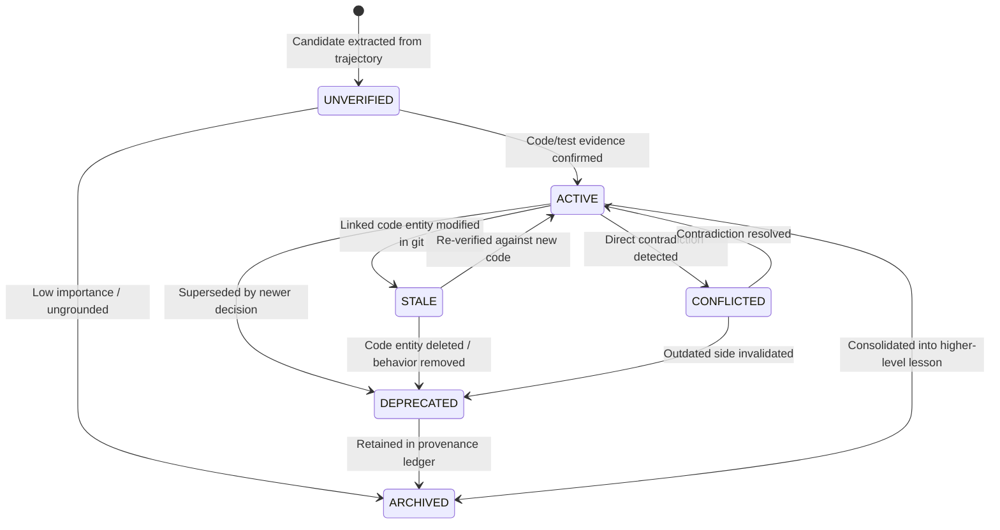

# Memory Lifecycle & State Transition Specification

## Memory Hierarchy (L0–L6)

CortexForge stratifies memory into distinct cognitive layers to prevent conflating ephemeral scratchpad thoughts with immutable project invariants:

- **L0: Current Context**: Immediate tool outputs, active user prompt, transient prompt tokens.
- **L1: Working Memory**: In-flight task state, temporary hypotheses, unresolved debug steps (lifetime: single task execution).
- **L2: Project Structural Memory**: AST code entities, call graph, directory hierarchy, API route mappings (lifetime: synchronized with Git commit).
- **L3: Decision Memory**: Architectural Decision Records (ADRs), trade-off rationales, chosen design patterns (lifetime: until explicitly superseded).
- **L4: Episodic Memory**: Past task trajectories, bug hunts, failed approaches, test runs, regression incidents (lifetime: decays unless consolidated).
- **L5: Long-term Knowledge**: Consolidated guidelines, project conventions, verified domain constraints, operational invariants.
- **L6: Cross-project Skills**: Reusable patterns, framework idiomatic fixes, tooling recipes.

## Memory State Machine

Every memory item transitions through a formal state machine:

### Verification States:
1. `UNVERIFIED`: Extracted candidate awaiting automated source verification.
2. `ACTIVE`: Fully grounded, verified against current code or tests.
3. `STALE`: Upstream files or AST symbols modified in git diff; requires re-validation.
4. `CONFLICTED`: Contradicts an existing active memory without explicit supersession.
5. `DEPRECATED`: Replaced by a subsequent decision or obsolete due to refactoring.
6. `ARCHIVED`: Archived for historical provenance; excluded from default retrieval.

## Write & Extraction Pipeline

When an agent completes a task:
1. **Raw Trajectory Ingestion**: Collect tool calls, user feedback, file edits, and test outputs.
2. **Event Filtering**: Discard redundant chit-chat; retain actions, failures, decisions, and fixes.
3. **Candidate Memory Extraction**:
   - *Is this project-specific?*
   - *Is it durable beyond this single session?*
   - *Is it supported by concrete evidence (file, commit, test result)?*
   - *Does it provide actionable guidance for future tasks?*
4. **Deduplication & Conflict Detection**:
   - Compare vector similarity ($\text{sim} > 0.88$) and semantic intent.
   - Detect direct negation or opposing architectural assertions.
5. **Evidence Attachment**: Attach `MemoryEvidence` records linking exact commit SHA, file path, and AST line numbers.
6. **Importance Scoring**: Score based on frequency of component access, test impact, and architectural centrality ($0.0 \dots 1.0$).
7. **Persistence & Versioning**: Write to `memories` table and increment `memory_versions`.

## Consolidation & Decay

- **Periodic Consolidation**: Background worker clusters episodic memories ($k \ge 3$ similar incidents). It extracts generalized rules (e.g., "Postgres connection pooling must be initialized before worker startup") and links the individual episodes as supporting evidence, transitioning them to `ARCHIVED`.
- **Policy-Driven Retention**: Critical decisions (L3) and constraints (L5) have infinite TTL unless superseded. Episodic failures (L4) decay based on access recency and status of the underlying component.
