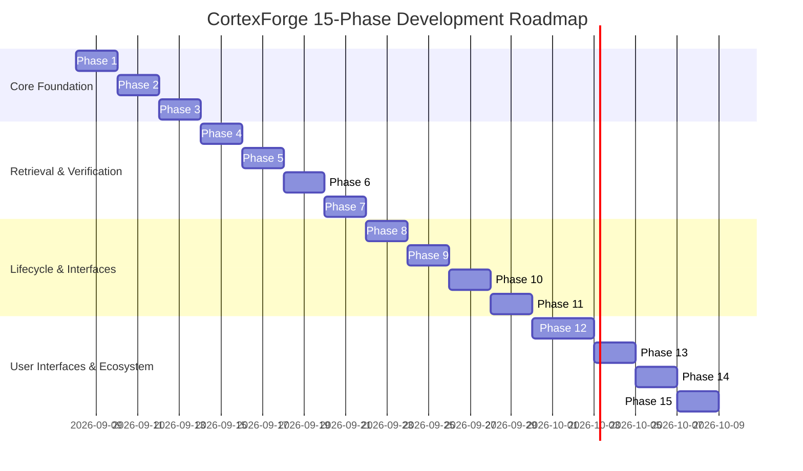

# CortexForge Development Roadmap

The platform is developed across 15 structured phases to ensure rigorous engineering and verifiable progress without premature complexity:

### Detailed Phase Breakdown

- **Phase 1: Repository Scanner & Architecture Slice (Current Phase)**
  - Deterministic AST extraction via Tree-sitter for TypeScript, JavaScript, Python, Java, Go.
  - Project registration and persistence of code entities and relationships in relational storage.
  - Project architecture query engine.
  - Initial REST API endpoint and CLI command (`cortex scan`, `cortex architecture`).
  - Unit and integration test suite proving end-to-end vertical slice.
- **Phase 2: Project Cognitive Model & Graph Schema**
  - Full relational graph representation and recursive dependency/dependent queries.
- **Phase 3: PostgreSQL Memory Engine & Vector Embeddings**
  - Layered memory (L0–L6) storage, versioning, evidence linkage, and pgvector search.
- **Phase 4: Hybrid Multi-Signal Retrieval**
  - Fusion of lexical, semantic, graph, recency, and provenance scores.
- **Phase 5: Git Change Tracking**
  - Safe Git CLI abstraction, commit snapshots, diff extraction, and blame tracking.
- **Phase 6: Semantic Change Propagation**
  - Git diff $\to$ affected AST entities $\to$ affected graph nodes $\to$ affected memories.
- **Phase 7: Memory Verification Engine**
  - Automated verification of memories against code entities and test outputs; status transitions.
- **Phase 8: Memory Consolidation Engine**
  - Clustering episodic events into durable knowledge principles with provenance archival.
- **Phase 9: Context Composer**
  - Token-budget-aware structured context formatting (small, medium, large).
- **Phase 10: Model Context Protocol (MCP) Server**
  - MCP stdio/SSE tools and resources implementation.
- **Phase 11: Production CLI (`cortex`)**
  - Full suite of commands: `init`, `scan`, `status`, `architecture`, `memory`, `context`, `graph`, `doctor`, `mcp`, `serve`.
- **Phase 12: Developer Web Dashboard**
  - Next.js, React Flow architecture graph, Memory Explorer, Token Economics.
- **Phase 13: GitHub App & Webhook Ingestion**
  - Webhook handlers for `push`, `pull_request`, and automated incremental scanning.
- **Phase 14: Evaluation & Benchmark Framework**
  - Multi-agent comparison harness (Baseline vs Naive RAG vs Flat vs CortexForge).
- **Phase 15: Production Hardening**
  - OpenTelemetry distributed tracing, rate limiting, RBAC, and container packaging.
